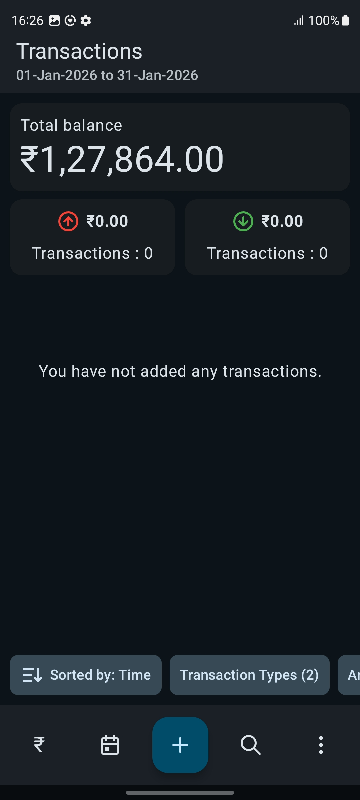
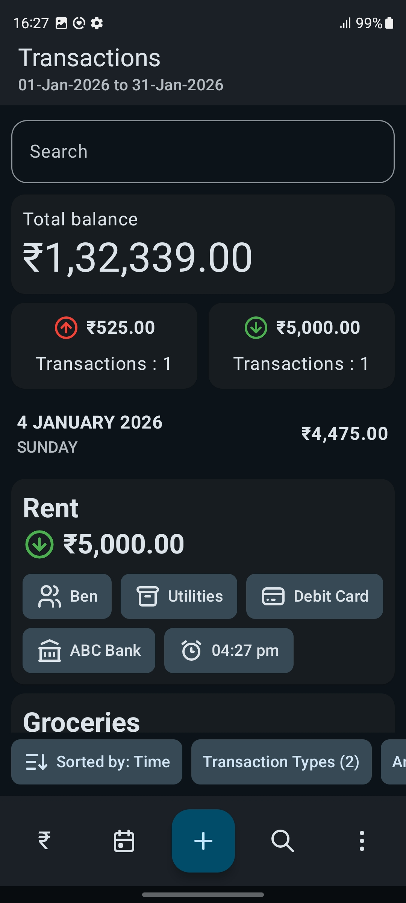
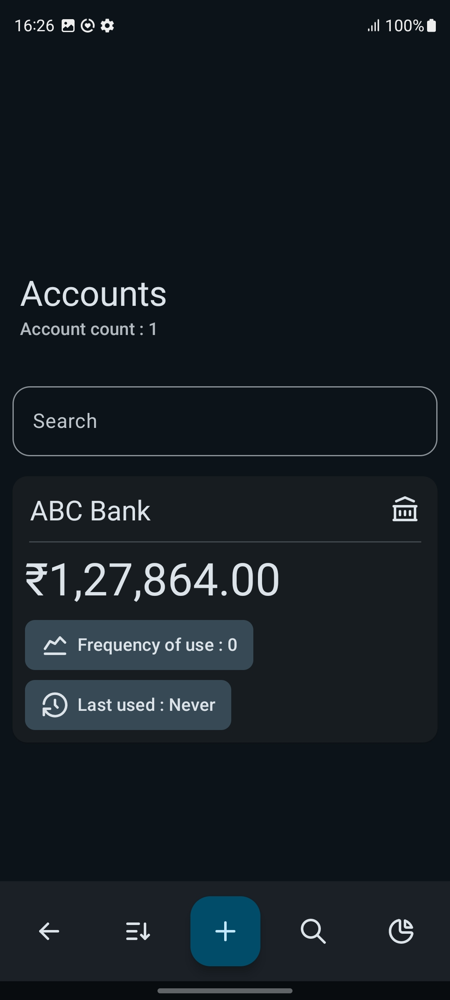
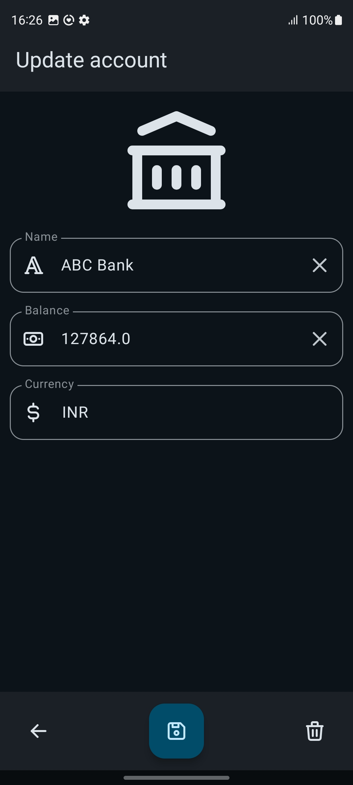
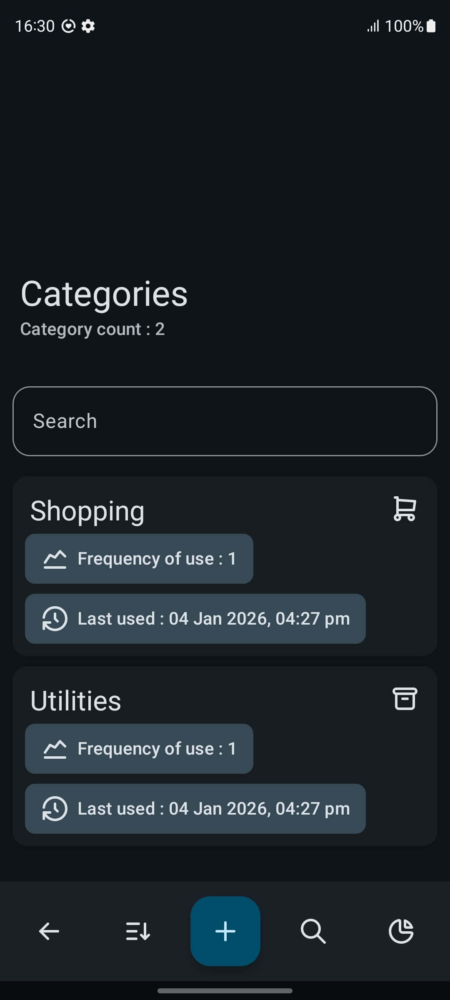
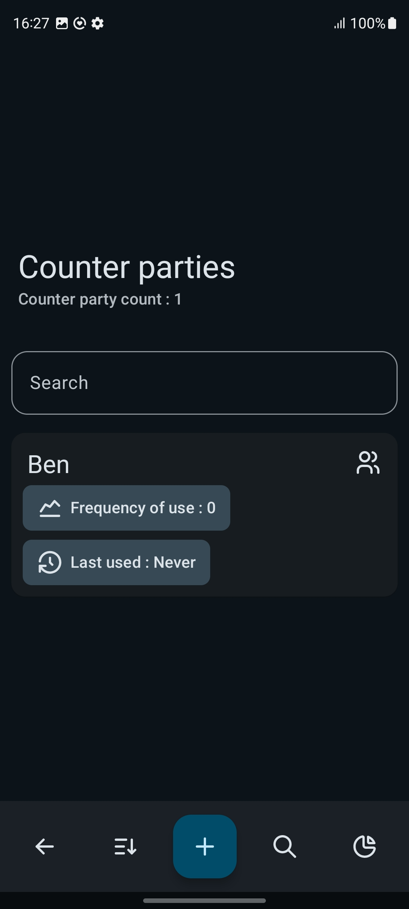
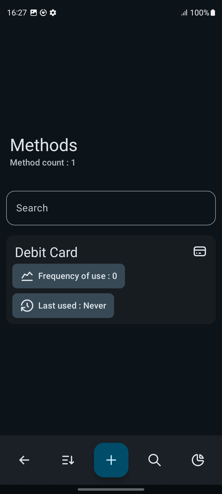
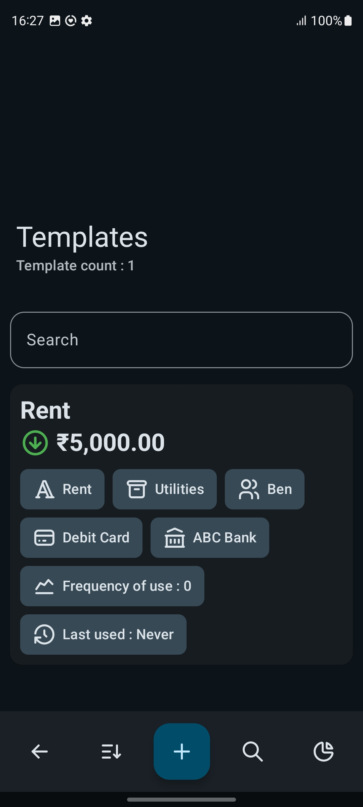
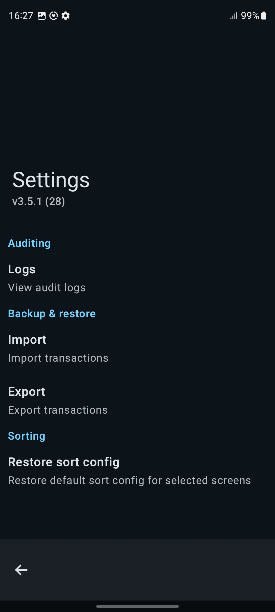

# CashFlow - Expense Tracker

Simple expense tracker built with Jetpack Compose and Kotlin

### Tech Stack

---

| Layer                | Technology                |
|:---------------------|:--------------------------|
| Architecture         | MVVM + Repository Pattern |
| Persistence          | SQLDelight                |
| Dependency Injection | Koin                      |
| Async                | Kotlin Coroutines & Flow  |
| UI                   | Jetpack Compose           |
| Design               | Material 3 / Material You |
| Language             | Kotlin                    |

### Screenshots

---

<div align="center">
<table>
<tr>
<td align="center" width="33%">

</td>
<td align="center" width="33%">

</td>
<td align="center" width="33%">

</td>
</tr>
<tr>
<td align="center" width="33%">

</td>
<td align="center" width="33%">

</td>
<td align="center" width="33%">

</td>
</tr>
<tr>
<td align="center" width="33%">

</td>
<td align="center" width="33%">

</td>
<td align="center" width="33%">

</td>
</tr>
</table>
</div>

### Dependencies

---

- [compose-icons](https://github.com/DevSrSouza/compose-icons) [MIT-License]
- navigation-compose [Apache 2.0 License]
- datastore-preferences [Apache 2.0 License]
- [kotlinx-serialization-json](https://github.com/Kotlin/kotlinx.serialization) [Apache 2.0 License]
- [vico](https://github.com/patrykandpatrick/vico) [Apache 2.0 License]
- [sqldelight](https://github.com/sqldelight/sqldelight/) [Apache 2.0 License]
- [moshi](https://github.com/square/moshi/) [Apache 2.0 License]
- [okio](https://github.com/square/okio/) [Apache 2.0 License]
- [koin](https://github.com/InsertKoinIO/koin) [Apache 2.0 License]
- [kotlinx-datetime](https://github.com/Kotlin/kotlinx-datetime) [Apache 2.0 License]
- [time-picker](https://github.com/DongChyeon/TimePicker) [MIT License]
- core-ktx [Apache 2.0 License]
- lifecycle-runtime-ktx [Apache 2.0 License]
- androidx.compose.material3.adaptive:adaptive [Apache 2.0 License]
- activity-compose [Apache 2.0 License]
- compose-bom [Apache 2.0 License]
- androidx.compose.ui:ui [Apache 2.0 License]
- ui-graphics [Apache 2.0 License]
- ui-tooling-preview [Apache 2.0 License]
- material3 [Apache 2.0 License]

### License

---

```
GNU General Public License - Version 3

CashFlow - Expense Tracker
Copyright (C) 2025 ThomasGRG

This program is free software: you can redistribute it and/or modify
it under the terms of the GNU General Public License as published by
the Free Software Foundation, version 3 of the License.

This program is distributed in the hope that it will be useful,
but WITHOUT ANY WARRANTY; without even the implied warranty of
MERCHANTABILITY or FITNESS FOR A PARTICULAR PURPOSE.  See the
GNU General Public License for more details.

You should have received a copy of the GNU General Public License
along with this program.  If not, see <https://www.gnu.org/licenses/>.
```
